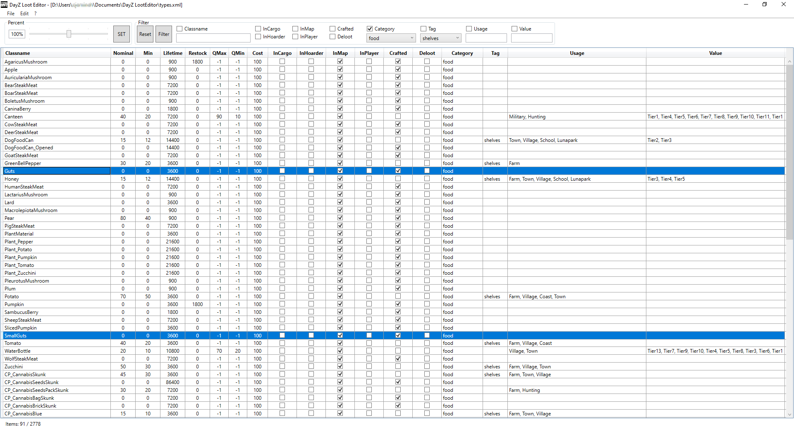

# DayZ LootEditor

An editor to comfortably modify the loot table of the game "DayZ (Standalone)".

---

**Version 0.2.1 Alpha**
#### **[DOWNLOAD](https://github.com/ojemineh/DayZLootEdit/releases)**

This tool requires at least **Windows 7** with **ServicePack 1**.

## Usage

The loot table of DayZ (Standalone) is stored in a XML file inside the current mission.
The file is called `types.xml` and can be found in the `mpmissions` folder in the server files or the game files. For the current version of the game it's stored in the following location: 
`\mpmissions\dayzOffline.chernarusplus\db\types.xml`

Usually the file from the dedicated server has to be changed.
Changing the file in your local game folder will only affect yourself while playing in offline mode.

To start, open the file `types.xml`. 

Note: Alle values can be changed, even though you shouldn't do so. For example, don't change the name of any object, it will break the game.

## License

MIT License

Copyright (c) 2021 by O. Jemineh

Permission is hereby granted, free of charge, to any person obtaining a copy
of this software and associated documentation files (the "Software"), to deal
in the Software without restriction, including without limitation the rights
to use, copy, modify, merge, publish, distribute, sublicense, and/or sell
copies of the Software, and to permit persons to whom the Software is
furnished to do so, subject to the following conditions:

The above copyright notice and this permission notice shall be included in all
copies or substantial portions of the Software.

THE SOFTWARE IS PROVIDED "AS IS", WITHOUT WARRANTY OF ANY KIND, EXPRESS OR
IMPLIED, INCLUDING BUT NOT LIMITED TO THE WARRANTIES OF MERCHANTABILITY,
FITNESS FOR A PARTICULAR PURPOSE AND NONINFRINGEMENT. IN NO EVENT SHALL THE
AUTHORS OR COPYRIGHT HOLDERS BE LIABLE FOR ANY CLAIM, DAMAGES OR OTHER
LIABILITY, WHETHER IN AN ACTION OF CONTRACT, TORT OR OTHERWISE, ARISING FROM,
OUT OF OR IN CONNECTION WITH THE SOFTWARE OR THE USE OR OTHER DEALINGS IN THE
SOFTWARE.

---
